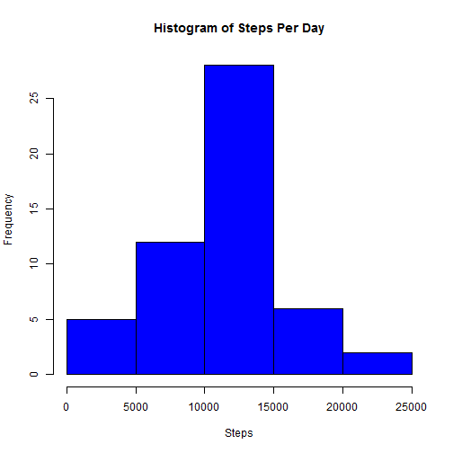
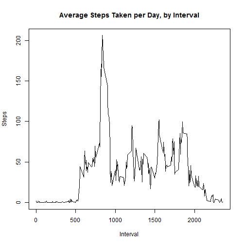
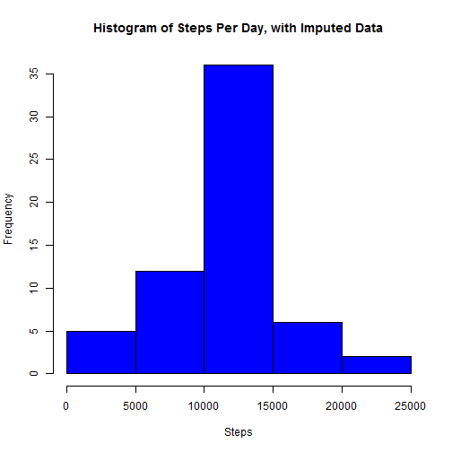
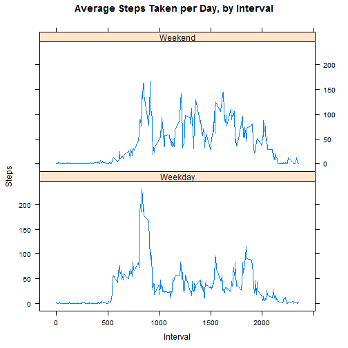

###Load Required Packages

```r
library(lattice)
```

###Loading and preprocessing the data

```r
#set the URL for the data file
fileurl <- "https://d396qusza40orc.cloudfront.net/repdata%2Fdata%2Factivity.zip"

#check to see if the zip file exists in the working directory, download if not
if(!file.exists("activity.zip"))
  download.file(fileurl,"activity.zip")

#check to see that the zip file has been unzipped, unzip if not
if(!file.exists("activity.csv"))
  unzip("activity.zip")

#read raw data into R
RawData <- read.csv("activity.csv", colClasses = c("numeric","Date","numeric"))

##add week day for analysis in later sections
RawData$day <- weekdays(RawData$date)
```

###What is the mean total number of steps taken per day?

```r
#aggregate number of steps by day for analysis
StepsPerDay <- aggregate(steps~date,RawData,sum)
```

1. Make a histogram of the total number of steps taken each day

```r
hist(StepsPerDay$steps,main="Histogram of Steps Per Day",xlab="Steps",col="blue")
```

 

2. Calculate and report the mean and median total number of steps taken per day

```r
mean(StepsPerDay$steps)
```

```
## [1] 10766.19
```

```r
median(StepsPerDay$steps)
```

```
## [1] 10765
```

###What is the average daily activity pattern

```r
#aggregate number of steps by interval for analysis
StepsPerInt <- aggregate(steps~interval,RawData,mean)
```

1. Make a time series plot (i.e `type="l"`) of the 5 minute interval (x-axis) and the average number of steps taken, averaged across all days (y-axis)

```r
plot(StepsPerInt$interval,StepsPerInt$steps,type = "l",main="Average Steps Taken per Day, by Interval",xlab="Interval",ylab="Steps")
```

 

2. Which 5 minute interval, on average across all the days in the dataset, contains the maximum number of steps?

```r
MaxInt <- StepsPerInt[which.max(StepsPerInt$steps),]
print(MaxInt)
```

```
##     interval    steps
## 104      835 206.1698
```
The interval containing the most steps on average is 835, at 206.17 steps

###Imputing Missing Values
1. Calculate and report the total number of missing values in the dataset (i.e the total number of rows with `NA`s)

```r
NARows <- RawData[!complete.cases(RawData),]
nrow(NARows)
```

```
## [1] 2304
```
There are 2304 missing values.

2. Devise a strategy for filling in all of the missing values in the dataset. 

I elected to use the mean value for each interval. The mean steps per interval was already calculated and stored in StepsPerInt.

3. Create a new dataset that is equal to the original dataset but with the missing data filled in.

```r
#To process the imputation, I created separate datasets for NA and Non-NA data. I used 

NonNARows <- RawData[complete.cases(RawData),]

NARowsFilled <- transform(NARows, steps = StepsPerInt$steps[match(NARows$interval,StepsPerInt$interval)])

CompData <- rbind(NARowsFilled,NonNARows)
```

4. Make a histogram of the total number of steps taken each day and report the mean and median total number of steps taken per day.

```r
#aggregate number of steps by day for analysis
StepsPerDayImp <- aggregate(steps~date,CompData,sum)

hist(StepsPerDayImp$steps,main="Histogram of Steps Per Day, with Imputed Data",xlab="Steps",col="blue")
```

 

```r
mean(StepsPerDayImp$steps)
```

```
## [1] 10766.19
```

```r
median(StepsPerDayImp$steps)
```

```
## [1] 10766.19
```

Imputing the data caused the following changes:

1. The mean of the data did not change
2. The median changes slightly, 10765 to 10766.19. Some of the daily values are no longer integers because their numeric averages were imputed into the data
3. Comparing the histograms, the curve does not change significantly. The height of some columns is higher, mainly because there are more date points to examine that were originally excluded because they were NA. The data is still slightly skewed to the right.

###Are there differences in activity patterns between weekdays and weekends?

1. Create a new factor variable in the dataset with tow levels - "weekday" and "weekend"

```r
CompData <- transform(CompData, daytype = ifelse(day %in% c("Saturday","Sunday"),"Weekend","Weekday"))
```

2. Make a panel plot containing a time series plot (i.e. `type="l"`) of the 5-minute interval (x-axis) and the average number of steps taken, averaged across all weekday days or weekend days (y-axis).

```r
StepsPerIntComp <- aggregate(steps~interval + daytype,CompData,mean)

xyplot(steps~interval | daytype, StepsPerIntComp, type="l", layout=c(1,2),main="Average Steps Taken per Day, by Interval",xlab="Interval",ylab="Steps")
```

 

Average activity appears to be higher on weekends. There is a higher spike, beginning around the 500 interval on weekdays, reducing quickly after the max interval (based on previous analysis, the max interval is 835).
